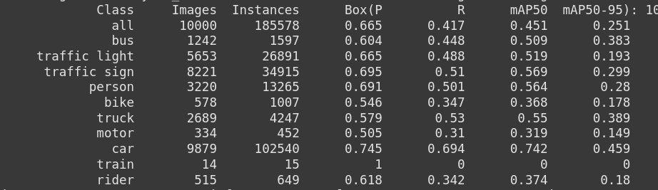

# YOLO Training and Evaluation

This repository contains scripts for downloading, analyzing, training, and evaluating a YOLO model on the BDD dataset.

## Download and Prepare the Dataset

Run the following commands to download and extract the BDD dataset:

```bash
wget http://128.32.162.150/bdd100k/bdd100k_images_100k.zip
unzip bdd100k_images_100k.zip
wget http://128.32.162.150/bdd100k/bdd100k_labels.zip
unzip bdd100k_labels.zip
```

## Install Dependencies

After downloading the dataset, install the required dependencies:

```bash
pip install -r requirements.txt
```

## Analyzing the Dataset

Run the following command to perform dataset analysis:

```bash
docker pull ghcr.io/tanu1393/bdd100k_object_detection/bdd100k-analysis:latest
docker run --rm -v local/path/to/BDD100k/dataset:/app/dataset bdd100k-analysis:latest
```

To build the image run:

```bash
cd docker
docker build -t bdd100k-analysis .
```

This script will analyze the dataset and generate various plots, such as class distributions, bounding box size distributions, occlusion statistics, and metadata distributions. The results will be saved as images in the dataset directory.

## Training the Model

Run the following command to train the YOLO model:

```bash
python train.py --data_dir 100k --yolo_data_dir yolo_dataset --epochs 10 --batch_size 16 --img_size 640 --output_dir results --fraction 0.1
```

### Model Used:
- **YOLOv8m** was used for training.
- The trained model weights and evaluation results are stored in the `results` directory.

### Arguments:
- `--data_dir`: Path to the dataset directory (default: `100k`).
- `--yolo_data_dir`: Output directory for YOLO formatted data (default: `yolo_dataset`).
- `--epochs`: Number of training epochs (default: `10`).
- `--batch_size`: Batch size for training (default: `16`).
- `--img_size`: Image size for training (default: `640`).
- `--output_dir`: Output directory for training results (default: `results`).
- `--fraction`: Fraction of the dataset to be used for training (default: `0.1`).

## Evaluating the Model

Run the following command to evaluate the trained model:

```bash
python evaluate.py --model_path results/train11/weights/best.pt --data_yaml yolo_dataset/data.yaml
```

### Arguments:
- `--model_path`: Path to the trained YOLO model weights (default: `results/train11/weights/best.pt`).
- `--data_yaml`: Path to the dataset YAML configuration file (default: `yolo_dataset/data.yaml`).

### Evaluation Output:
- The evaluation results, including performance metrics, are stored in the `results` directory.
- Below are evaluation results from trained YOLOv8m model on validation set


